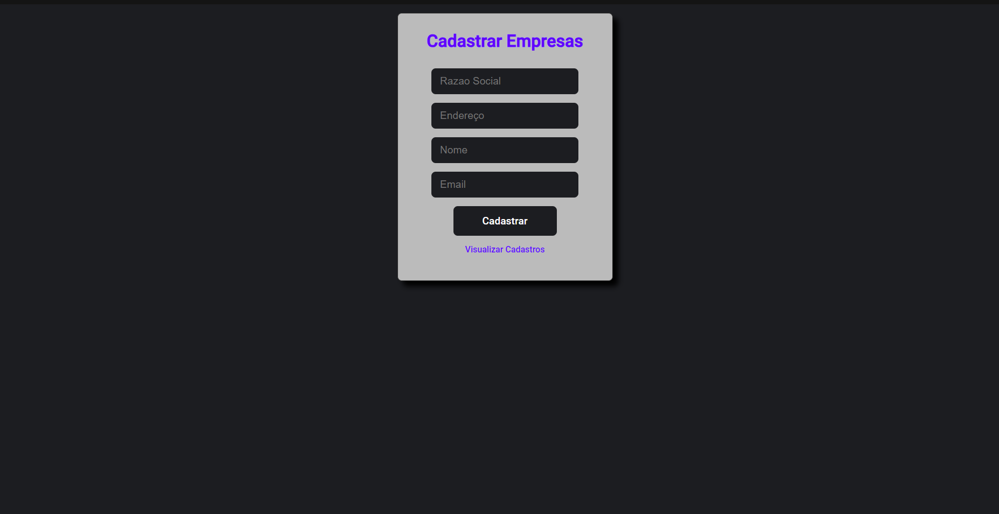
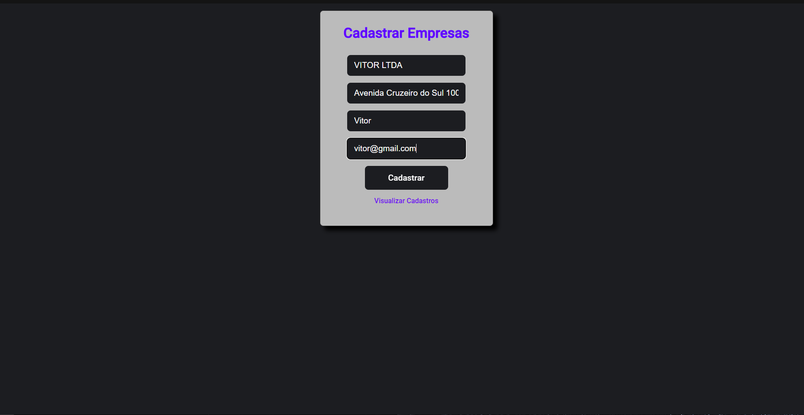
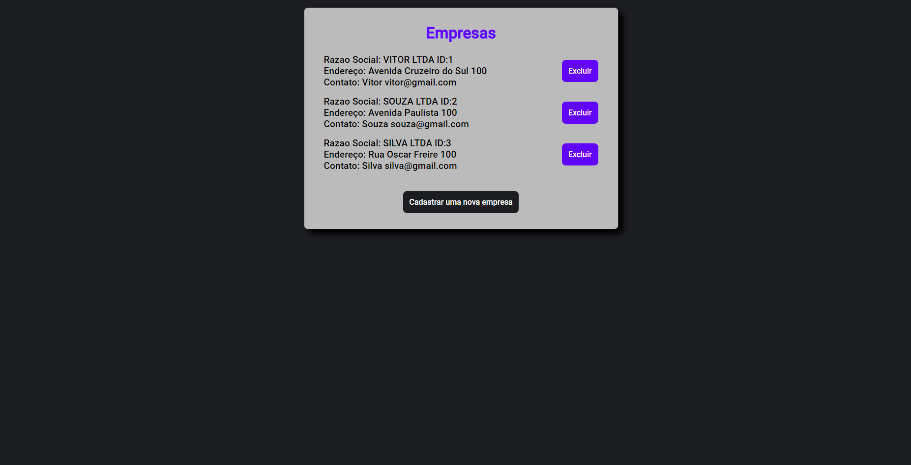
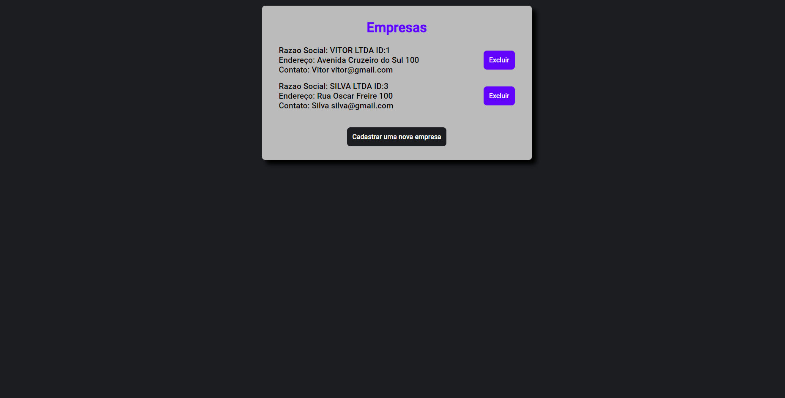
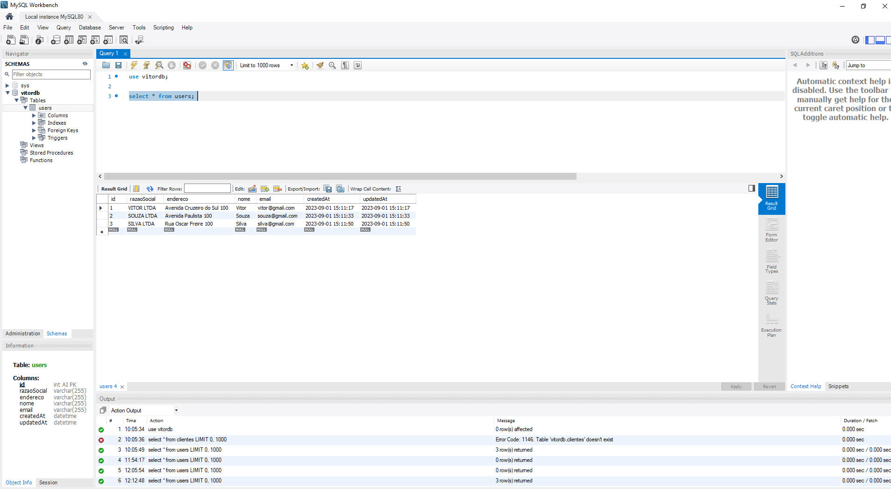
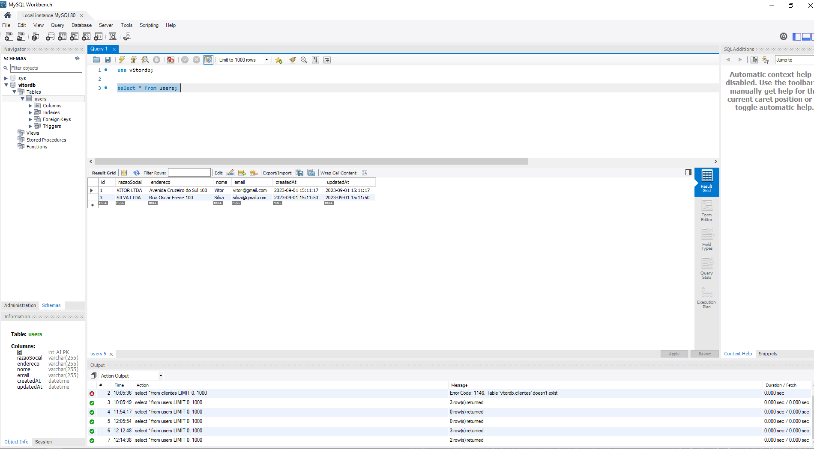

# 📊 Companies

Este projeto foi criado para um teste técnico e tem como objetivo cadastrar informações de empresas, como endereço e contato, por meio de uma aplicação web conectada a um banco de dados local.

## 🔨 Funcionalidade

O projeto consiste em duas páginas principais: uma para o cadastro de empresas e outra para listar as empresas cadastradas, permitindo a exclusão de registros. Cada empresa é exibida com um identificador único e suas informações estão armazenadas em um banco de dados local

## 🧰 Tecnologias 

* NodeJS - Utilizado para implementar a lógica e as operações do banco de dados.
* Express - Responsável por criar a aplicação web e definir as rotas necessárias.
* Sequelize - Usado para interagir com o banco de dados por meio de JavaScript.
* Handlebars - Utilizado para incorporar a lógica JavaScript diretamente no HTML para processar as requisições do formulário via POST.
* CSS - Responsável pela estilização das páginas.
* MySQL - Utilizado como o banco de dados local do projeto.
* WorkBench - Utilizado para visualização dos dados inseridos no banco de dados.

## ⚙ Inicialização

Para começar, siga os passos abaixo:

Primeiramente é necessario instalar todos os frameworks e modulos utilizados 

* Crie um diretório para o seu projeto: `mkdir meu-projeto`  

* Acesse o diretório do projeto: `cd meu-projeto`  

* Inicialize um arquivo package.json: `npm init -y`  

* Instale as dependências necessárias:`npm install express sequelize mysql2 express-handlebars body-parser `

Lembre-se de baixar e configurar o banco de dados MySQL conforme necessário.

A aplicação está configurada para rodar localmente na porta 8080. Para visualizá-la, basta acessar o endereço: http://localhost:8080

Após a inicialização e o cadastro de registros, você poderá visualizar os dados no WorkBench.
## Imagens 

### Cadastro

### Registros

### Excluindo Registro

### Banco de Dados

### Excluido no Banco de Dados

